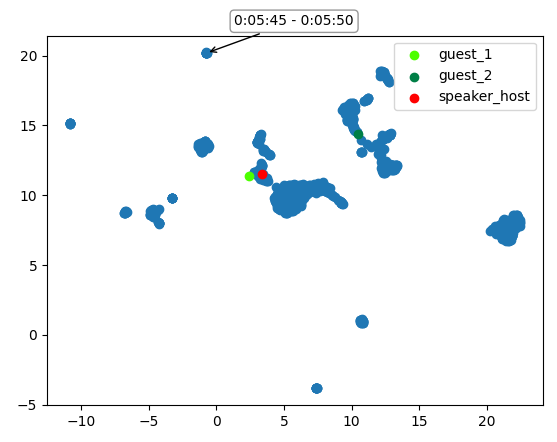

# radio-bias-analysis

Analysing radio political party bias using Speaker Verification embeddings with audio enrollment

<div align="center"></div>

### Requirements: 
- Clone the [Real-Time-Voice-Cloning](https://github.com/CorentinJ/Real-Time-Voice-Cloning) repo
- ```export SPK_VERIFICATION_REPO=<path_to_cloned_repo>```
- ```pip install -r requirements.txt```

### Running:
- ```processor.py``` - export speaker embeddings for segments of the input audio
- ```analyse.py``` - analyse embeddings with any saved references

### TODO: 
- K-means clustering of speaker embeddings
- Run Voice Activity Detection to extract relevant segments from audio
- Get duration of speaker's time on radio
